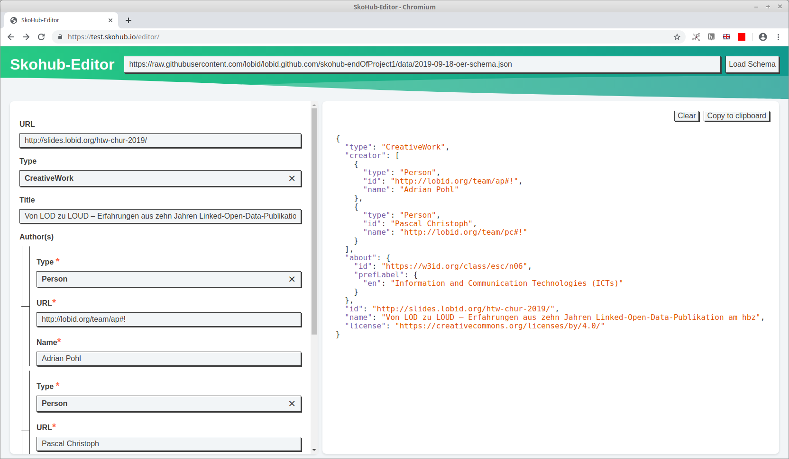
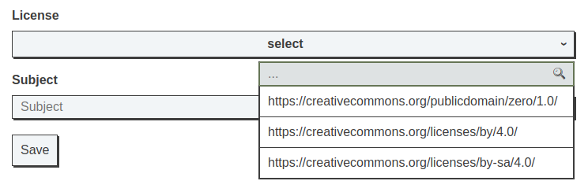

In a [previous blog post](http://blog.lobid.org/2019/09/27/presenting-skohub-vocabs.html) we presented a first SkoHub module: *SkoHub Vocabs*. Before talking about another module, first a short summary of the features SkoHub Vocabs offers. Basically, it provides an editorial workflow to publishing a SKOS vocabulary on the web to be consumed by humans and applications. It builds on git-based online software development platforms (currently GitHub and GitLab are supported) where you maintain a SKOS schemes as a Turtle file, thus being able to use all the associated features (branches, merge requests) for a full-fledged review process. With every new commit in a branch, triggered by a webhook, SkoHub Vocabs will build a static site for the vocab – with HTML for human consumption and JSON-LD for consumption by applications.

In this post, we will present *SkoHub Editor* ([demo](https://skohub.io/editor/), [code](https://github.com/hbz/skohub-editor)) that is accompanied by a browser extension ([Firefox](https://addons.mozilla.org/en-US/firefox/addon/skohub-extension/), Chrome to follow). In a nutshell, SkoHub Editor enables the automatic generation of a web form based on a JSON schema, along with the possibility to lookup terms in a controlled vocabulary that is published with SkoHub Vocabs. Additionally, described resources can be published using SkoHub PubSub. Let's take a look at the specifics by creating an editor that lets you create JSON-LD describing an open educational resource (OER) on the web. 

# Configuring & using the editor

So we want to create an editor that lets you create JSON-LD describing an OER that is published somewhere on the web. SkoHub Editor is configured with a [JSON schema](https://json-schema.org/understanding-json-schema/) document that is simultaneously used for the validation of the entered content. Accordingly, this is what we have to start with. We created a [basic JSON schema](https://github.com/lobid/lobid.github.com/blob/master/data/oer-schema.json) for recording the URL, title, creator(s) of a resource and choosing a license & topic it is about.

We can now load [a web form](https://skohub.io/editor/?schema=https://raw.githubusercontent.com/lobid/lobid.github.com/master/data/oer-schema.json) in SkoHub Editor by providing the link to the [raw JSON file of the schema](https://raw.githubusercontent.com/lobid/lobid.github.com/skohub-endOfProject1/data/oer-schema.json) and then start to input the information. In times of the Corona pandemic, we use as an example the YouTube video ["COVID-19 | 6 Dangerous Coronavirus Myths, Busted by World Health Organization"](https://www.youtube.com/watch?v=ZaiDDOZcaqc) published recently by the World Economic Forum under a CC-BY license.

As you can see, the JSON-LD is output on the right-hand side of the screen and can easily be copied to the clipboard to be included in the HTML of any web page.

The underlying schema is pretty straightforward. As with every JSON schema I can for specify a number of optional or mandatory fields, what type of input each field expects. I also can provide a list of values to be selected from for a specific field like the schema does for choosing one of three OER licenses in [lines 65 to 74](https://github.com/lobid/lobid.github.com/blob/3ebb98904e01cc445c27f966686de4012f93cae5/data/2019-09-18-oer-schema.json#L65-L74). In the  SkoHub Editor this is then reflected by a "select" under the "License" field button where after clicking all three values are shown in a dropdown.

We said to also enable adding a subject from a controlled vocabulary to each resource. When inputing content into the "Subject" field, we also get a dropdown with suggestions:

This time, these values are not listed in the JSON Schema but a SkoHub-specific addition to JSON schema – the SkoHub Lookup Widget – is used. It works with all controlled vocabularies that are published with the SkoHub Static Site Generator. The next paragraph describes how to publish a vocabulary with the SkoHub Static Site Generator so that it can be looked up in the SkoHub editor and additional SkoHub functionalities can be utilized.
