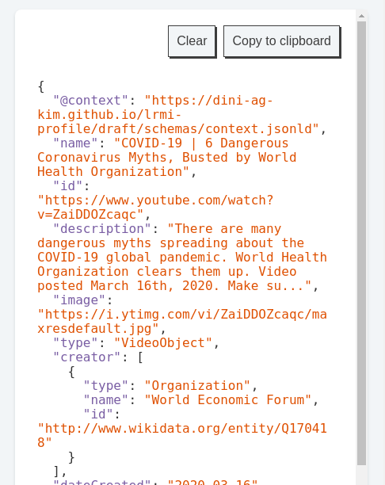

In a [previous blog post](http://blog.lobid.org/2019/09/27/presenting-skohub-vocabs.html) we presented a first SkoHub module: *SkoHub Vocabs*. Before talking about another module, first a short summary of the features SkoHub Vocabs offers. Basically, it provides an editorial workflow to publish a SKOS vocabulary on the web which can then be consumed by humans and applications. It builds on git-based online software development platforms (currently GitHub and GitLab are supported) where you maintain a SKOS vocabulary as a Turtle file. This allows you to use all the associated features such as branches and pull requests for a full-fledged review process. With every new commit in a branch, triggered by a webhook, SkoHub Vocabs will build a static site for the vocab – with HTML for human consumption and JSON-LD for consumption by applications.

In this post, we present *SkoHub Editor* ([demo](https://skohub.io/editor/), [code](https://github.com/hbz/skohub-editor)) that is accompanied by a browser extension. In a nutshell, SkoHub Editor enables the automatic generation of a web form based on a JSON schema, along with the possibility to lookup terms in a controlled vocabulary that is published with SkoHub Vocabs. Additionally, metadata generated by the editor can be published using SkoHub PubSub, which we will describe in an upcoming post. Let's take a look at the specifics by configuring an editor that lets you create JSON-LD describing an open educational resource (OER) on the web.

# Describing a resource with the browser extension

Let's start with actually using SkoHub Editor. You will have the most comfortable experience when using the SkoHub browser extension that wraps the SkoHub Editor and pre-populates some field in the web form. The browser extension is available both for [Firefox](https://addons.mozilla.org/en-US/firefox/addon/skohub-extension/) and [Chrome](tbd). Just add the extension to your browser and a little icon will be shown on the right-hand side of your navigation bar:


While having any web page open, you can now open the SkoHub editor in your browser to describe that web resource. In times of a coronavirus pandemic, let's use as an example the YouTube video ["COVID-19 – 6 Dangerous Coronavirus Myths, Busted by World Health Organization"](https://www.youtube.com/watch?v=ZaiDDOZcaqc) published recently by the World Economic Forum under a CC-BY license. Open the video in your browser, click on the extension and you will see that several fields are automatically filled out.


We can now add additional metadata by selecting a type (`VideoObject` in this case), add a creator, creation date, language etc. As we mentioned, you are also able for some fields to look up a subject from a controlled vocabulary in the web form. You will experience this when inputting content into the fields "Subject", "License", "Learning Resource Type", "Intended Audience". For those fields you will get a drop down with suggestions from a controlled vocabulary, e.g. for "Subject" from a German [classification](https://w3id.org/kim/hochschulfaechersystematik/scheme) of subjects in Higher education that is published with SkoHub Vocabs.


Currently, only the fields "URL", "Type" and "Title are obligatory, all other fields are optional. When you think you have described the resource sufficiently, you can click on "Show Preview" in the extension, copy & paste the JSON-LD to the clipboard and include it in the HTML of any web page within a `<script type="application/ld+json">` tag. 



Using the [content subscription & publication features of SkoHub](http://blog.lobid.org/2019/05/17/skohub.html#subject-specific-subscription-to-web-resources), you can furthermore publish the resource via SkoHub PubSub (to be covered in detail in an upcoming post).

# Configuring the web form with JSON Schema

As said above, the SkoHub Extension wraps the SkoHub Editor running at [https://skohub.io/editor/](https://skohub.io/editor/). SkoHub Editor is configured with a [JSON schema](https://json-schema.org/understanding-json-schema/) document that is used both to generate appropriate form inputs and to validate the entered content. Thus, the JSON Schema is the central, most crucial part when working with SkoHub Editor. Currently, we are using a [draft schema for OER](https://dini-ag-kim.github.io/lrmi-profile/draft/schemas/schema.json) we created using relevant properties and types from [schema.org](https://schema.org) as the default schema. With the JSON schema URL, we can now load the [web form](https://skohub.io/editor/?schema=https://dini-ag-kim.github.io/lrmi-profile/draft/schemas/schema.json) you already know from the browser extension by providing the link to the schema.

Let's take a short look at the underlying schema, which we tried to keep as straightforward as possible. Generally, with JSON schema you can specify a number of optional or mandatory properties and what type of input each expects. The `"title"` of each property will be used as the label for the field in the web form.

```
{
  "properties": {
    "name": {
      "title": "Title",
      "type": "string",
    }
  }
}
```

It is also possible to allow values only from a predefined list (an `enum`), which the editor will render as a drop down:

```
{
  "type": {
    "title": "Type",
    "type": "string",
    "enum": [
      "AudioObject",
      "Book",
      "Course",
      "CreativeWork",
      "DataDownload",
      "ImageObject",
      "PresentationDigitalDocument",
      "SoftwareApplication",
      "VideoObject"
    ]
  },
}
```

Such lists of allowed values can be considered controlled vocabularies, and ideally they should be shared across many data sources. This is where SkoHub vocabs comes into play. Instead of embedding the list of allowed values into our schema, we can reference a SKOS vocabulary on the web:

```
{
  "about": {
    "title": "Subject",
    "type": "array",
    "items": {
      "type": "object",
      "properties": {
        "inScheme": {
          "type": "object",
          "properties": {
            "id": {
              "type": "string",
              "enum": [
                "https://w3id.org/kim/hochschulfaechersystematik/scheme"
              ]
            }
          }
        }
      },
      "_widget": "SkohubLookup"
    }
  },
}
```

Notice the custom key `_widget` in the JSON schema. This will configure the editor to use the specified UI element for the given field. In our example, the `SkohubLookup` widget is used, which works with all controlled vocabularies that are published with SkoHub Vocabs. All custom JSON schema extension start with an underscore `_` and are used to control the look and feel of the editor; see below for an example for how to hide a field on the form.

Finally, to make our data JSON-LD, we also set a mandatory `@context` property with only possible value – a link to the JSON-LD context at `https://dini-ag-kim.github.io/lrmi-profile/draft/schemas/context.jsonld`, and a default value for the `@context`. This makes the editor add it to the document without any user interaction needed.

```
{
  "$schema": "http://json-schema.org/draft-07/schema#",
  "title": "OER",
  "description": "This is a generic JSON schema for describing an Open Educational Resource with schema.org",
  "type": "object",
  "default": {
    "@context": "https://dini-ag-kim.github.io/lrmi-profile/draft/schemas/context.jsonld"
  },
  "properties": {
    "@context": {
      "type": "string",
      "format": "uri",
      "enum": [
        "https://dini-ag-kim.github.io/lrmi-profile/draft/schemas/context.jsonld"
      ],
      "_display": {
        "className": "hidden"
      }
    }
  }
}
```

# Implementation

Of course you can also poke around the editor while running it locally:

    $ git clone https://github.com/hbz/skohub-editor.git
    $ cd skohub-editor
    $ npm install

As is the case with SkoHub vocabs, the editor is implemented in [React](https://reactjs.org/). The form components are located in `src/components/JSONSchemaForm`. In a nutshell, a `Form` provides data to the various input components:

```
<Form
  data={{title: 'A title'}}
  onSubmit={console.log}
>
  <Input property="title" />
  <Textarea property="description" />
  <button type="submit">Publish</button>
</Form>
```

Obviously it would be tedious to manually code all the inputs for a given schema. This is where the `Builder` comes into play. It reads a schema and creates all necessary input components:

```
<Form
  data={{title: ''}}
  onSubmit={console.log}
>
  <Builder schema={{
    "$schema": "http://json-schema.org/draft-07/schema#",
    "title": "My JSON schema",
    "type": "object",
    "properties": {
      "title": {
        "type": "string",
        "title": "Title"
      },
      "description": {
        "type": "string",
        "title": "Description",
        "_widget": "Textarea"
      }
    }
  }} />
  <button type="submit">Publish</button>
</Form>
```

# Outlook

SkoHub Editor already works very well and can be extremely useful for different purposes. However, some things are still work in progress and will need some future effort to be improved:

- **Unfinished Vocabularies**: For "Learning Resource Type" and "intended Audience" we are using controlled vocabularies that are in development at the Dublin Core Metadata Initiative (DCMI). You will see that they might be missing some options. However, we assume that the combination of SkoHub Editor & SkoHub Vocabs makes a pretty nice environment for further developing these vocabularies with an open and transparent process on dsvfGitHub or GitLab.
-  **Custom JSON-LD context**: As we are using some SKOS elements besides schema.org markup, we decided to publish a custom JSON-LD context for the editor output. However, it seems like Google won't detect and use the schema.org markup although it is the. We might have to think about another way to addressing this, e.g. by embedding the context in each document orby solely using schema.org markup (see [#31](https://github.com/hbz/skohub-editor/issues/31)).